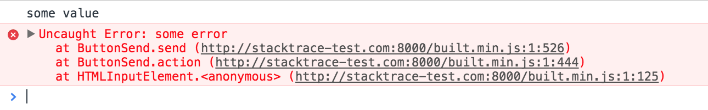

# Прототип извлечения информации об ошибке из stack trace ошибки сжатого скрипта
 
## Подготовка

Должен быть установлен node.
`npm install` - установим все библиотеки
`grunt` - стартуют grunt задачи, собирающие исходные файлы в один сжатый файл, стартует статический сервер для отдачи файлов
и будет открыта страница демки в дефолтном браузере.

## Получение ошибки

Нажимаем кнопку на страничке демо, в консоли браузера получаем ошибку:


И хотя, в браузере мы видим уже деобфусцированные файлы и корректное место ошибки
(благодаря map файлу), в продакшене этого не будет. Ошибки продакшена мы видим только в аналитике

## Расшифровка ошибки

Текст ошибки скопируем из браузера в демо-скрипт дешифровки (`utils/decodeError.js`):

```
...
error.stack = (
		'file2.js:11 Uncaught Error: some error' +
		' at ButtonSend.send (http://stacktrace-test.com:8000/built.min.js:1:526)' +
		' at ButtonSend.action (http://stacktrace-test.com:8000/built.min.js:1:444)' +
		' at HTMLInputElement.<anonymous> (http://stacktrace-test.com:8000/built.min.js:1:125)'
	)
...
```

Выполним в консоли:
```
utils/decodeError.js
```

Получим:
```
send()@../src/file2.js:11:7
action()@../src/file2.js:7:6
ButtonSimple()@../src/file1.js:5:7
```

Profit!

## Некоторые детали

Стек ошибок в разных браузерах выглядит немного по разному, поэтому код подготовки преобразования строки stacktrace в
массив объектов, будет немного отличаться. Парсер умеет работать с разным форматом, но расстановка переносов, удаление
первой строки (текста ошибки) и вырезание uri - полностью на нашей ответственности

В демо не предусмотрена обработка ошибок. Если парсер или маппер где-то запнутся, не сработает вообще ничего. Молча.

Важная деталь - параметр `sourceMapIn`. Без этого параметра cжимальщик не будет учитывать исходные файлы, ему просто 
неоткуда узнать из каких файлов собран единственный файл. Этот же параметр мог бы позволить учитывать исходные файлы
после компиляции ES6->ES5, если бы она была.

Есть еще статья и демка: https://github.com/mattzeunert/stacktrace-js-example. Но уж очень сложный код для демо. Плюс
питон + все происходит в браузере + меня коробит, когда подобным образом обращаются промисами.

